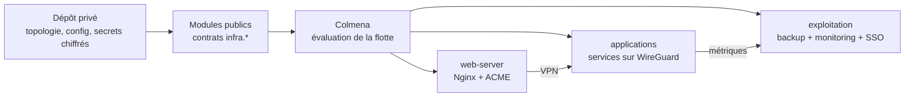

# Server Setup

Modules NixOS pour gérer une flotte avec Colmena, WireGuard, SOPS, Nginx,
Restic, Prometheus, Grafana et Kanidm.

Le dépôt public contient tout le fonctionnement réutilisable. Chaque
infrastructure est un second dépôt privé, généré depuis `template/`, qui ne
conserve que sa topologie, ses choix finaux et ses secrets chiffrés.

## Démarrage rapide

Prérequis : Nix, une clé SSH, un serveur Debian neuf et les credentials des
services externes utilisés. L'infection remplace le système du serveur.

```sh
# Créer le dépôt privé
nix run github:theking90000/server-setup#bootstrap-project -- ./my-infra
cd ./my-infra

# Renseigner inventory/nodes.nix et config/, puis charger les outils
nix develop

# Répéter pour chaque serveur Debian
infect-server -i ~/.ssh/id_ed25519 -p 22 --post-port 22 debian@203.0.113.10

# Générer hardware, clés, destinataires SOPS et secrets standards
init-project

# Compléter seulement les champs CHANGEME signalés
sops secrets/acme.json

# Vérifier, déployer un canari, puis toute la flotte
check-project
deploy-project vps1
deploy-project
```

Le [guide d'installation A–Z](docs/SETUP-GUIDE.md) détaille DNS OVH/Lego,
infection, SOPS, secrets, vérifications, déploiement et opérations courantes.

## Modèle mental

Un nœud possède des tags. Le module responsable d'un tag :

1. active le service sur les nœuds concernés ;
2. déclare son secret SOPS et sa consommation runtime ;
3. lie le service au mesh WireGuard ;
4. publie ses ACL, ingress, backups, métriques, dashboards et clients SSO ;
5. laisse Nginx, Restic, Prometheus, Grafana et Kanidm agréger ces contributions.



La distinction importante est la portée :

- `services.hasTag tag` protège une configuration locale ;
- `services.getHostsByTag tag` et `getVpnIpsByTag tag` découvrent toute la
  flotte pour les contributions inter-nœuds.

## Deux dépôts, une seule responsabilité par service

| Dépôt public | Dépôt privé |
|---|---|
| Modules NixOS et déclarations SOPS | Inventaire des nœuds et tags |
| Helpers `services` et `ops` | URLs, ports et feature flags |
| Scripts de bootstrap et déploiement | JSON SOPS chiffrés |
| Template et checks synthétiques | Hardware et modules spécifiques |

`infra.nixosModules.default` importe `sops-nix`. SOPS fait partie du contrat
normal : il n'existe pas d'adaptateur privé central ni de module SOPS à importer
séparément. Le code Grafana, secret inclus, reste dans `grafana.nix`; la même
règle s'applique à chaque service.

Le dépôt privé configure seulement la racine des fichiers chiffrés :

```nix
imports = [ infra.nixosModules.default ];

infra.sops.secretsDirectory = ./secrets;
infra.acme.certSyncerPublicKeyFile = ./inventory/keys/syncer.key.pub;
```

Les options texte et `*File` encore visibles dans certains modules sont des
chemins de compatibilité et de test. Une nouvelle infrastructure utilise le
chemin SOPS par défaut.

## Rôles disponibles

### Flotte

| Tag ou activation | Fonction |
|---|---|
| Toujours actif | Réseau de base, OpenSSH et mesh WireGuard |
| `web-server` | Nginx public et ingress HTTPS |
| `acme-issuer` | Certificats DNS-01 et synchronisation |
| `backup` | Backups Restic |
| `node-metrics` | Node Exporter |
| `prometheus` | Agrégation des cibles déclarées |
| `grafana` | Datasources et dashboards provisionnés |
| `kanidm` | Identité, OIDC/OAuth2 et LDAPS |
| `infra.rcloneSync.mounts` | Montages ciblés par nœud, sans tag |

### Applications

| Tag | Service |
|---|---|
| `applications/docker-registry` | Registre OCI authentifié |
| `applications/filesave-server` | Partage de fichiers |
| `applications/gitea` | Forge Git |
| `applications/jellyfin` | Serveur multimédia |
| `applications/ntfy` | Notifications push |
| `applications/reposilite` | Dépôt Maven |
| `applications/www` | Hébergement statique |
| `applications/sncb-insights` | Application fournie par le dépôt privé |

## Outils du dev shell

| Commande | Rôle |
|---|---|
| `bootstrap-project` | Créer un dépôt privé depuis le template |
| `infect-server` | Remplacer Debian par NixOS |
| `init-project` | Préparer hardware, clés, SOPS et secrets absents |
| `update-sops-keys` | Recalculer les destinataires et re-chiffrer en staging |
| `check-project` | Refuser les placeholders puis évaluer Nix et Colmena |
| `deploy-project [hôte]` | Initialiser, vérifier et déployer |
| `adopt-hardware` | Récupérer les configurations matérielles |
| `generate-mesh` | Générer les clés WireGuard absentes |
| `export-ssh-key` | Exporter les clés publiques d'administration |
| `generate-key` | Générer la paire SSH du cert-syncer |

`init-project` et `deploy-project` sont idempotents : un fichier secret existant
n'est pas remplacé. Les credentials externes manquants sont créés sous forme de
`CHANGEME` chiffrés et listés précisément.

## Structure

```text
.
├── flake.nix
├── nixos/
│   ├── lib/                  # découverte par tags et helpers de déploiement
│   ├── modules/              # modules NixOS par responsabilité
│   └── pkgs/                 # paquets spécifiques
├── scripts/                  # commandes distribuées par le flake
├── template/                 # squelette du dépôt privé
├── docs/
│   ├── SETUP-GUIDE.md        # installation et exploitation A–Z
│   ├── MODULE-GUIDE.md       # contrat complet d'un module
│   └── KANIDM-CLI.md         # administration Kanidm
└── AGENTS.md
```

## Documentation

- [Installer une infrastructure de A à Z](docs/SETUP-GUIDE.md)
- [Écrire ou maintenir un module](docs/MODULE-GUIDE.md)
- [Administrer les comptes et groupes Kanidm](docs/KANIDM-CLI.md)
- [Comprendre le dépôt privé généré](template/README.md)

## Développer et vérifier

Un module public doit rester propriétaire de toutes ses intégrations. Le
[MODULE-GUIDE](docs/MODULE-GUIDE.md) fournit le squelette, les règles de portée
et la checklist réseau, secrets, ingress, backup, métriques, dashboard et SSO.

```sh
# Dépôt public
nix flake check --all-systems

# Dépôt privé, depuis nix develop
check-project
```

Après une modification de déploiement, une évaluation réussie doit être suivie
d'un canari réel avant `deploy-project` sur toute la flotte.
