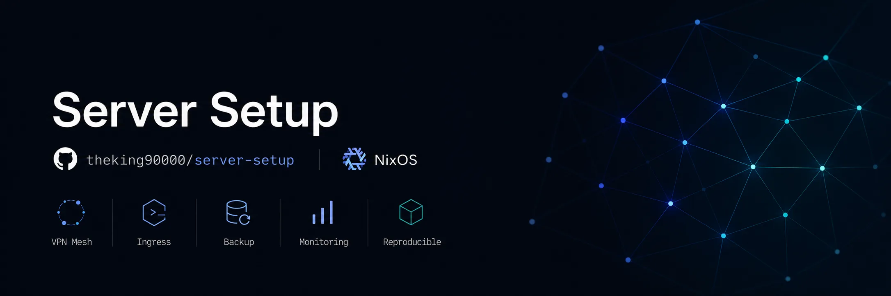
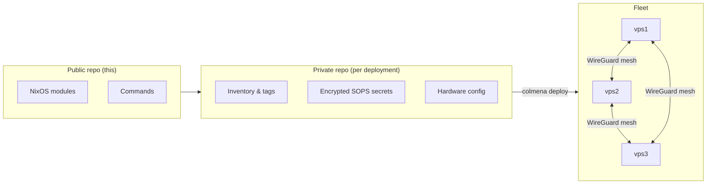

<p align="center">
  
</p>

<p align="center">
  <em>Infrastructure as code for plain Linux. A robust, deterministic server fleet without the orchestrator.</em>
</p>

<p align="center">
  
  
  
</p>

Server Setup turns a fleet of fresh Debian machines into a fully declarative
NixOS deployment. Every server is described in code, reproducible bit for bit,[^repro]
and runs on plain systemd, with no container runtime or orchestrator in the way.
Nodes join a private WireGuard mesh and automatically get HTTPS ingress, single
sign-on, encrypted secrets, backups and monitoring.

Each deployment uses a separate private repository generated from `template/`.
That repository contains the node topology, service configuration, encrypted
secrets, hardware configuration, and deployment-specific modules.

## Features

- 🧬 **Infrastructure as code**: the entire fleet is declarative and version-controlled
- 🪨 **Robust & deterministic**: plain systemd on NixOS, reproducible builds
- 🌐 **Private mesh**: every node joins an encrypted WireGuard network automatically
- 🚪 **HTTPS ingress**: Nginx with automatic Let's Encrypt certificates
- 🔐 **Security & SSO**: encrypted secrets (SOPS) and identity via Kanidm (OIDC/LDAPS)
- 💾 **Backups**: scheduled, deduplicated Restic backups
- 📊 **Monitoring**: Prometheus metrics and provisioned Grafana dashboards

## 🚀 Quick start

Requirements: Nix, an SSH key, a fresh Debian server, and credentials for the
enabled external services.

> [!WARNING]
> `infect-server` **replaces the server's operating system**. Only run it on a
> machine you intend to wipe.

```sh
# Create the private repository
nix run github:theking90000/server-setup#bootstrap-project -- ./my-infra
cd ./my-infra

# Edit inventory/nodes.nix and the configuration of enabled services
nix develop

# Repeat for each Debian server
infect-server -i ~/.ssh/id_ed25519 -p 22 --post-port 22 debian@203.0.113.10

# Generate hardware configuration, keys, SOPS recipients, and standard secrets
init-project

# Replace the reported CHANGEME values
sops secrets/acme.json

# Check the configuration, deploy one canary, then deploy the full fleet
check-project
deploy-project vps1
deploy-project
```

The [setup guide](docs/SETUP-GUIDE.md) covers OVH/Lego DNS, server infection,
SOPS, secrets, checks, deployment, and routine operations.

## 🧩 How modules configure the fleet

Each node has tags. The module that registers a tag:

1. enables the service on matching nodes;
2. declares its SOPS secret and runtime consumer;
3. binds the service to the WireGuard mesh;
4. registers its ACLs, ingress, backups, metrics, dashboards, and SSO clients;
5. lets Nginx, Restic, Prometheus, Grafana, and Kanidm collect these
   declarations.

Scope determines which guard a module uses:

- `services.hasTag tag` guards configuration for the current node.
- `services.getHostsByTag tag` and `getVpnIpsByTag tag` discover nodes across
  the fleet for cross-node declarations.

A file under `config/` can remain imported without configuration while no node
has its service tag. Its placeholders and values are not evaluated in that
case. The file must still contain valid Nix syntax.

## 🔒 Service ownership and private configuration



| Public repository                   | Private repository                                     |
| ----------------------------------- | ------------------------------------------------------ |
| NixOS modules and SOPS declarations | Node inventory and tags                                |
| `services` and `ops` helpers        | URLs, ports, and feature flags                         |
| Bootstrap and deployment commands   | Encrypted SOPS JSON files                              |
| Template and synthetic checks       | Hardware configuration and deployment-specific modules |

`infra.nixosModules.default` imports `sops-nix`. A private repository does not
need a separate SOPS module or a central adapter. `grafana.nix` declares both
the Grafana service and its secret. Each public service module follows the same
ownership rule.

The private repository only sets the encrypted secret directory:

```nix
imports = [ infra.nixosModules.default ];

infra.sops.secretsDirectory = ./secrets;
infra.acme.certSyncerPublicKeyFile = ./inventory/keys/syncer.key.pub;
```

Some modules still expose text and `*File` options for compatibility and tests.
New deployments use SOPS by default.

## 📦 Available roles

### Fleet services

| Tag or activation         | Service                                             |
| ------------------------- | --------------------------------------------------- |
| Always enabled            | Base networking, OpenSSH, and the WireGuard mesh    |
| `web-server`              | Public Nginx and HTTPS ingress                      |
| `acme-issuer`             | DNS-01 certificates and certificate synchronization |
| `backup`                  | Restic backups                                      |
| `node-metrics`            | Node Exporter                                       |
| `prometheus`              | Collection of registered scrape targets             |
| `grafana`                 | Provisioned data sources and dashboards             |
| `kanidm`                  | Identity, OIDC/OAuth2, and LDAPS                    |
| `infra.rcloneSync.mounts` | Per-node mounts without a tag                       |

### Applications

| Tag                            | Service                                        |
| ------------------------------ | ---------------------------------------------- |
| `applications/docker-registry` | Authenticated OCI registry                     |
| `applications/filesave-server` | File sharing                                   |
| `applications/gitea`           | Git forge                                      |
| `applications/jellyfin`        | Media server                                   |
| `applications/ntfy`            | Push notifications                             |
| `applications/reposilite`      | Maven repository                               |
| `applications/www`             | Static hosting                                 |
| `applications/sncb-insights`   | Application provided by the private repository |

## 🛠️ Development shell commands

| Command                 | Action                                                               |
| ----------------------- | -------------------------------------------------------------------- |
| `bootstrap-project`     | Create a private repository from the template                        |
| `infect-server`         | Replace Debian with NixOS                                            |
| `init-project`          | Create missing hardware configuration, keys, SOPS files, and secrets |
| `update-sops-keys`      | Recompute recipients and re-encrypt staged files                     |
| `check-project`         | Reject encrypted placeholders, then evaluate Nix and Colmena         |
| `deploy-project [host]` | Initialize, check, and deploy                                        |
| `adopt-hardware`        | Fetch hardware configuration from the nodes                          |
| `generate-mesh`         | Generate missing WireGuard keys                                      |
| `export-ssh-key`        | Export administration SSH public keys                                |
| `generate-key`          | Generate the certificate syncer's SSH key pair                       |

`init-project` and `deploy-project` do not overwrite existing secret files.
Missing external credentials are created as encrypted `CHANGEME` values and
reported by path.

## 🗂️ Repository layout

<details>
<summary>Show the repository tree</summary>

```text
.
├── flake.nix
├── nixos/
│   ├── lib/                  # tag discovery and deployment helpers
│   ├── modules/              # NixOS modules grouped by service
│   └── pkgs/                 # project-specific packages
├── scripts/                  # commands distributed by the flake
├── template/                 # private repository skeleton
├── docs/
│   ├── SETUP-GUIDE.md        # setup and operations
│   ├── MODULE-GUIDE.md       # module contract
│   └── KANIDM-CLI.md         # Kanidm administration
└── AGENTS.md
```

</details>

## 📚 Documentation

- [Set up a deployment](docs/SETUP-GUIDE.md)
- [Write or maintain a module](docs/MODULE-GUIDE.md)
- [Manage Kanidm accounts and groups](docs/KANIDM-CLI.md)
- [Configure the generated private repository](template/README.md)

## ✅ Development and checks

A public module owns all integrations for its service. The
[module guide](docs/MODULE-GUIDE.md) provides the module skeleton, scope rules,
and checks for networking, secrets, ingress, backups, metrics, dashboards, and
SSO.

```sh
# Public repository
nix flake check --all-systems

# Private repository, from nix develop
check-project
```

After a deployment change passes evaluation, deploy it to one canary before
running `deploy-project` for the full fleet.

[^repro]: Reproducibility covers the system itself: on a fresh install the same
    configuration rebuilds an identical machine. Runtime user data (databases,
    uploads, application state) lives outside that guarantee. It is covered
    separately by Restic backups, and in most cases a healthy backup restores
    the data in a handful of commands, often a single one.
