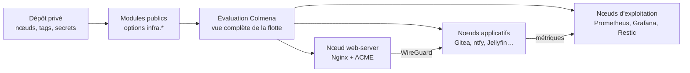

# Server Setup

> Une flotte NixOS déclarative, reliée par WireGuard et déployée avec Colmena.

`server-setup` est une bibliothèque publique de modules NixOS pour gérer
plusieurs serveurs comme un seul système : réseau privé, découverte par tags,
pare-feu inter-services, ingress HTTPS, sauvegardes et monitoring.

Le dépôt ne contient ni inventaire réel ni secret. Une infrastructure utilise
un second dépôt privé, créé depuis [`template/`](template/), qui fournit les
nœuds, les tags et les valeurs `infra.*`.

## Pourquoi ce projet ?

- une seule topologie décrit tous les nœuds ;
- les flux applicatifs internes passent par le mesh WireGuard ;
- seul Nginx expose les routes HTTP des applications sur Internet ;
- ACL, sauvegardes, métriques et dashboards sont déclarés par les modules ;
- les configurations sont évaluées ensemble puis déployées par Colmena ;
- le dépôt public reste réutilisable et n'impose aucun gestionnaire de secrets.

## Le modèle mental

Un nœud privé possède des **tags**. Un module public enregistre un tag, puis :

1. active son service sur les nœuds qui portent ce tag ;
2. écoute sur l'adresse VPN quand le service le permet, sinon limite l'accès
   au mesh avec les ACL ;
3. déclare ses besoins annexes : ACL, backup, ingress, télémétrie et dashboard ;
4. laisse les modules centraux agréger ces déclarations pour toute la flotte.



La subtilité importante est la portée des options NixOS :

- `lib.mkIf (services.hasTag tag)` configure uniquement le nœud courant ;
- une télémétrie ou un ingress peut être déclaré globalement afin qu'un autre
  nœud — Prometheus ou Nginx — le découvre pendant la même évaluation.

Cette distinction est détaillée dans le
[`MODULE-GUIDE`](docs/MODULE-GUIDE.md#7b-cross-node-side-effects--global-vs-per-node-guards).

## Architecture à deux dépôts

| Dépôt public — celui-ci | Dépôt privé — votre infrastructure |
|---|---|
| Modules NixOS réutilisables | Inventaire des nœuds et tags |
| Helpers `services` et `ops` | URLs et paramètres des applications |
| Scripts d'installation | Secrets chiffrés ou chemins runtime |
| Template de démarrage | Flake Colmena réellement déployé |
| Checks synthétiques | Configurations matérielles des hôtes |

Le dépôt privé importe `nixosModules.default` depuis ce dépôt. Il peut aussi
ajouter ses propres modules et paquets sans modifier la bibliothèque publique.

## Démarrage rapide

Prérequis : Nix, une clé SSH et un serveur Debian accessible. L'infection
remplace le système du serveur ; utilisez-la uniquement sur une machine neuve
ou sauvegardée.

```sh
# 1. Créer le dépôt privé
nix run github:theking90000/server-setup#bootstrap-project -- ./my-infra
cd ./my-infra

# 2. Renseigner inventory/nodes.nix et les fichiers config/
nix develop

# 3. Infecter chaque VPS ; -p est le port Debian, --post-port le port NixOS
infect-server -i ~/.ssh/id_ed25519 -p 22 --post-port 22 root@203.0.113.10

# 4. Récupérer le hardware, préparer les clés et évaluer tous les nœuds
just prepare
just check

# 5. Déployer après validation
just deploy vps1
just deploy
```

Le guide du dépôt généré se trouve dans
[`template/README.md`](template/README.md).

## Modules disponibles

### Socle et rôles de flotte

| Tag ou activation | Fonction |
|---|---|
| Toujours actif | Réseau de base, OpenSSH et mesh WireGuard |
| `web-server` | Nginx public, ingress HTTPS et métriques VTS |
| `acme-issuer` | Émission ACME et synchronisation des certificats |
| `backup` | Sauvegardes Restic et restauration |
| `node-metrics` | Node Exporter et métriques système |
| `prometheus` | Agrégation des cibles déclarées par les modules |
| `grafana` | Dashboards et datasources Prometheus provisionnés |

### Applications

| Tag | Service |
|---|---|
| `applications/docker-registry` | Registre OCI avec authentification |
| `applications/filesave-server` | Serveur de partage de fichiers |
| `applications/gitea` | Forge Git |
| `applications/jellyfin` | Serveur multimédia |
| `applications/ntfy` | Notifications push |
| `applications/reposilite` | Dépôts Maven |
| `applications/www` | Hébergement statique |
| `applications/sncb-insights` | Intégration spécifique avec paquet fourni par le dépôt privé |

### Modules spéciaux

Ces modules fonctionnent, mais ne font pas partie du check synthétique
« services stables ». Kanidm possède un check SSO dédié :

| Activation | Pourquoi il est spécial |
|---|---|
| `kanidm` | Provisioning d'identité, OAuth2 et LDAPS |
| `infra.rcloneSync.mounts` | Montages ciblés par `targetNodes`, sans tag |

L'administration des comptes, credentials et groupes Kanidm est détaillée
dans le [`guide CLI Kanidm`](docs/KANIDM-CLI.md).

## Lire un module en une minute

[`gitea.nix`](nixos/modules/applications/gitea.nix) est un bon exemple. Les
modules applicatifs suivent le même chemin de lecture :

1. `tag`, `enabled`, `port` et `dataDir` donnent le contrat du service ;
2. `options.infra.<app>` expose les valeurs du dépôt privé ;
3. `infra.registeredTags` rend les fautes de tag détectables ;
4. le bloc `lib.mkIf enabled` contient le service local, ses ACL et backups ;
5. les blocs suivants publient télémétrie, ingress et dashboards à la flotte.

```nix
let
  tag = "applications/myapp";
  enabled = services.hasTag tag;
  cfg = config.infra.myapp;
in {
  options.infra.myapp = { /* API publique */ };

  config = lib.mkMerge [
    { infra.registeredTags = [ tag ]; }

    (lib.mkIf enabled {
      services.myapp.enable = true;
      infra.security.acls = [ /* accès VPN */ ];
      infra.backup.paths = [ "/var/lib/myapp" ];
    })

    { infra.telemetry.myapp = /* découverte globale */; }

    (lib.mkIf (cfg.url != null && services.getVpnIpsByTag tag != [ ]) {
      infra.ingress.myapp = /* route Nginx globale */;
    })
  ];
}
```

Le squelette complet et les règles de portée sont documentés dans
[`docs/MODULE-GUIDE.md`](docs/MODULE-GUIDE.md).

## Secrets

Le dépôt public reste indépendant du backend de secrets :

- une ancienne valeur texte peut être envoyée par `ops.mkSecretKeys` via
  `deployment.keys` Colmena ;
- les options `*File` permettent de fournir un chemin runtime tel que
  `/run/secrets/...`, notamment avec `sops-nix` dans le dépôt privé ;
- un module interdit de fournir simultanément la valeur texte et son fichier ;
- un secret runtime n'est jamais lu avec `builtins.readFile`.

Les valeurs texte évitent le store de la machine cible, mais un dépôt Flake
privé en clair peut encore être copié dans le store de la machine qui évalue.
Pour une nouvelle infrastructure, préférez des fichiers chiffrés dans le dépôt
privé.

## Outils

Les commandes suivantes sont fournies par le dev shell :

| Commande | Rôle |
|---|---|
| `bootstrap-project` | Créer un dépôt privé depuis le template |
| `infect-server` | Remplacer Debian par NixOS |
| `adopt-hardware` | Récupérer `hardware-configuration.nix` avec root |
| `generate-mesh` | Créer les clés WireGuard absentes et recalculer les clés publiques |
| `export-ssh-key` | Dériver les clés publiques depuis `node.sshKey` |
| `generate-key` | Créer ou republier la clé du cert-syncer |

## Structure du dépôt

```text
.
├── flake.nix                 # module public, packages et checks
├── nixos/
│   ├── lib/                  # services.hasTag, découverte et mkSecretKeys
│   ├── modules/              # applications, réseau, sécurité, web, monitoring
│   └── pkgs/                 # paquets binaires spécifiques
├── scripts/                  # commandes distribuées par le flake
├── template/                 # squelette du dépôt privé
├── docs/
│   ├── KANIDM-CLI.md         # administrer comptes et groupes Kanidm
│   └── MODULE-GUIDE.md       # écrire et comprendre un module
└── AGENTS.md                 # modèle du dépôt pour les agents de code
```

## Développer et vérifier

```sh
# Dépôt public : modules synthétiques, template et scripts
nix flake check --all-systems

# Dépôt privé généré : flake puis drvPath de chaque nœud Colmena
just check
```

Le check « services stables » exclut volontairement Kanidm et Rclone. Le check
`grafana-sso` couvre séparément le provisioning Kanidm et l'intégration
Grafana. Une évaluation réussie ne remplace pas un déploiement canari.

## Vers une V2 plus lisible

La V2 ne remplace pas NixOS par une abstraction maison. Elle normalise l'ordre
et le vocabulaire des modules existants, conserve les API compatibles et traite
séparément Kanidm et Rclone.
